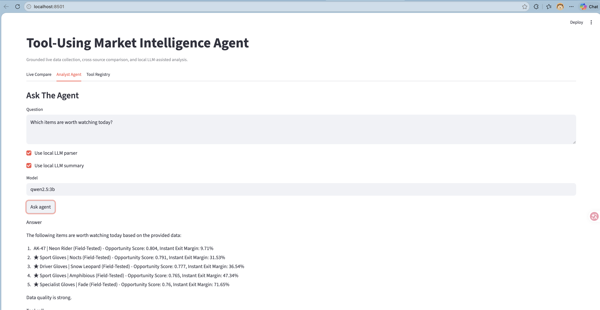

# Tool-Using CS2 Market Intelligence Agent

A grounded Python data-analysis agent for live market data collection, cross-source comparison, recommendation ranking, SQL analytics, and local LLM-assisted tool use.

## Overview

This project is a Python-based **local LLM-assisted tool-using market intelligence agent**.

It integrates live marketplace data collection, cross-source item normalization, feature engineering, recommendation ranking, SQL analytics, and traceable tool execution.

The system is designed as a grounded decision-support agent rather than an automatic trading bot. It does not execute purchases or sales. Instead, it calls deterministic tools to collect data, build datasets, run analysis, rank opportunities, and answer user questions with traceable evidence.

The local LLM layer is optional and lightweight. It uses a local Ollama model such as `qwen2.5:3b` only for:

1. parsing natural-language questions into validated tool calls
2. summarizing deterministic tool outputs

All prices, rankings, spreads, and data-quality results are produced by deterministic Python tools.

The agent supports two major modes:

1. **Live tool mode**
   - fetch live CSFloat snapshots
   - search UU / YouPin templates
   - fetch live UU market snapshots
   - compare one item across sources
2. **Offline analytics mode**
   - run SQL analytics over generated datasets
   - inspect data quality
   - analyze liquidity
   - summarize recommendation labels
   - retrieve top ranked opportunities



## Key Features

- Built an end-to-end Python data pipeline and tool-using agent that ingest live data from CSFloat and YouPin APIs.
- Normalized cross-market item names using Steam `market_hash_name` conventions.
- Generated structured datasets for cross-market pricing, liquidity, spread, demand, and risk analysis.
- Engineered business indicators including profit margin, instant-exit margin, liquidity score, demand score, supply score, risk score, and opportunity score.
- Built an explainable recommendation layer that ranks market opportunities and provides human-readable reasons.
- Added SQL analytics over generated datasets using in-memory SQLite.
- Added a validated tool-call agent that routes requests to vetted live collection, dataset refresh, and offline analytics tools.
- Added optional local Ollama support for tool-call parsing and summarizing deterministic tool outputs.
- Added a Streamlit demo for live comparison, analyst questions, and tool registry inspection.
- Added automated unit tests for parsers, feature engineering, recommendation ranking, SQL analytics, tool validation, trace behavior, and local LLM error handling.

## Architecture

```text
User question / structured command
  -> rule-based router or local LLM tool-call parser
  -> tool-call validation
  -> deterministic tool execution
  -> structured result
  -> optional local LLM summarizer
  -> answer with execution trace
```

The project supports three tool categories:

- Live data tools: fetch current CSFloat and UU / YouPin market snapshots.
- Dataset and recommendation tools: build datasets, features, and rankings.
- Analytics tools: run SQL analytics and recommendation queries over generated datasets.

The agent is grounded by design. It does not invent prices or rankings.

Dataset pipeline:

```text
data/watchlist.csv
  -> live CSFloat API client + live YouPin API client
  -> market_hash_name normalization
  -> data/opportunity_snapshots.csv
  -> feature engineering
  -> data/opportunity_features.csv
  -> recommendation ranking
  -> data/recommendations.csv
  -> SQL analytics and agent tools
```

## Project Structure

```text
cs2-cross-market-arbitrage-analyzer/
├─ app/
│  ├─ analytics.py
│  ├─ agent.py
│  ├─ compare.py
│  ├─ config.py
│  ├─ csfloat_client.py
│  ├─ dataset_builder.py
│  ├─ features.py
│  ├─ history.py
│  ├─ llm_analyst.py
│  ├─ local_llm.py
│  ├─ manual_integration.py
│  ├─ market_name.py
│  ├─ recommender.py
│  ├─ tool_schema.py
│  ├─ tools.py
│  ├─ uu_client.py
│  ├─ wear.py
│  └─ web_demo.py
├─ data/
│  ├─ watchlist.csv
│  ├─ opportunity_snapshots.csv
│  ├─ opportunity_features.csv
│  └─ recommendations.csv
├─ sql/
│  ├─ data_quality_report.sql
│  ├─ label_distribution.sql
│  ├─ liquidity_analysis.sql
│  └─ top_opportunities.sql
├─ tests/
│  ├─ test_agent_eval.py
│  ├─ test_agent.py
│  ├─ test_agent_trace.py
│  ├─ test_analytics.py
│  ├─ test_dataset_builder.py
│  ├─ test_features.py
│  ├─ test_llm_analyst.py
│  ├─ test_local_llm.py
│  ├─ test_market_name.py
│  ├─ test_recommender.py
│  ├─ test_tools.py
│  ├─ test_tools_live.py
│  └─ test_uu_client.py
├─ .env.example
├─ pyproject.toml
└─ README.md
```

## Quickstart

Install Python dependencies:

```bash
uv sync
```

If you are not using `uv`:

```bash
python3 -m venv .venv
source .venv/bin/activate
pip install -e .
```

Run the Streamlit demo:

```bash
streamlit run app/web_demo.py
```

Run the deterministic agent:

```bash
python3 -m app.agent "Summarize data quality"
```

## End-To-End Pipeline

Build the snapshot dataset:

```bash
python3 -m app.dataset_builder --overwrite
```

Compute business indicators:

```bash
python3 -m app.features --top 10
```

Build ranked recommendations:

```bash
python3 -m app.recommender --min-label watchlist --top 10
```

Run SQL analytics:

```bash
python3 -m app.analytics --query sql/top_opportunities.sql --limit 10
python3 -m app.analytics --query sql/data_quality_report.sql
python3 -m app.analytics --query sql/label_distribution.sql
python3 -m app.analytics --query sql/liquidity_analysis.sql
```

Ask natural-language analytics questions:

```bash
python3 -m app.agent "Which items are worth watching today?"
python3 -m app.agent "Summarize data quality"
python3 -m app.agent "Show label distribution"
python3 -m app.agent "Which items have strong liquidity?"
python3 -m app.llm_analyst "Which items are strong candidates and why?"
python3 -m app.llm_analyst "Summarize data quality"
```

## Local LLM Setup

Ollama is a local application/service, not a Python package. Do not install it with `uv add`.

Install Ollama on macOS:

```bash
brew install --cask ollama
```

Pull and run Qwen2.5 3B:

```bash
ollama run qwen2.5:3b
```

The local LLM endpoint is expected at:

```text
http://localhost:11434
```

The Python project calls this endpoint through `httpx`. No cloud LLM API key is required.

## Live Tool Demo

Compare one item using live CSFloat and UU data:

```bash
python3 -m app.agent \
  --tool compare_live_item \
  --base-name "Sport Gloves | Nocts" \
  --wear ft \
  --category normal \
  --uu-keyword "夜行衣" \
  --uu-index 0
```

Local LLM-assisted tool parsing:

```bash
python3 -m app.agent \
  --llm \
  "Compare Sport Gloves Nocts Field-Tested with UU keyword 夜行衣"
```

Streamlit demo:

```bash
streamlit run app/web_demo.py
```

Fetch a live CSFloat snapshot:

```bash
python3 -m app.agent \
  --tool fetch_csfloat_snapshot \
  --base-name "Sport Gloves | Nocts" \
  --wear ft \
  --category normal
```

Search UU / YouPin templates:

```bash
python3 -m app.agent \
  --tool search_uu_templates \
  --keyword "夜行衣"
```

Example trace:

```text
Tool selected: compare_live_item
Tool kind: live_comparison
Live API used: true
Trace:
1. validate_tool_call: ok
2. fetch_csfloat_snapshot: ok
3. search_uu_templates: ok
4. choose_uu_candidate: ok
5. fetch_uu_snapshot: ok
6. compare_snapshots: ok
```

Example agent output:

```text
Question: Which items are worth watching today?
Mode: deterministic
Intent: top_opportunities
Tool selected: top_opportunities
Tool kind: offline_analytics
Live API used: false
Evidence: data/recommendations.csv

Answer:
The strongest watchlist candidates are ...

Trace:
{
  "question": "...",
  "mode": "deterministic",
  "intent": "top_opportunities",
  "selected_tool": "top_opportunities",
  "tool_kind": "offline_analytics",
  "live_api_used": false,
  "evidence_files": ["data/recommendations.csv"],
  "steps": [{"name": "validate_tool_call", "status": "ok"}],
  "warnings": []
}
```

## Business Indicators

`profit_margin_pct`

```text
(cs_lowest_ask_usd - uu_lowest_ask_usd) / uu_lowest_ask_usd
```

Measures theoretical spread against the CSFloat lowest ask.

`instant_exit_margin_pct`

```text
(cs_highest_bid_usd - uu_lowest_ask_usd) / uu_lowest_ask_usd
```

Measures stricter executable spread against the CSFloat highest bid.

`cs_liquidity_score`

```text
0.65 * log_score(cs_vol24h, 50)
+ 0.35 * log_score(cs_bid_depth, 20)
```

Estimates exit liquidity using CSFloat 24h volume and bid depth.

`uu_supply_score`

```text
0.70 * log_score(uu_listings, 100)
+ 0.30 * log_score(uu_bid_depth, 50)
```

Estimates source-side supply and YouPin buy-order activity.

`demand_score`

```text
0.75 * log_score(cs_vol24h, 50)
+ 0.25 * log_score(uu_bid_depth, 50)
```

Combines recent CSFloat sales volume and YouPin bid depth.

`risk_score`

Penalizes missing margin, negative margin, thin margin, low liquidity, low supply, and weak data quality.

`opportunity_score`

```text
0.35 * profit_score
+ 0.25 * cs_liquidity_score
+ 0.20 * demand_score
+ 0.10 * uu_supply_score
+ 0.10 * data_quality_score
- 0.20 * risk_score
```

Final explainable ranking score.

## Recommendation Layer

The recommender reads `data/opportunity_features.csv`, filters opportunities by label, ranks them, and writes `data/recommendations.csv`.

Recommendation labels:

- `strong_candidate`
- `watchlist`
- `low_priority`
- `avoid`
- `insufficient_data`

Each recommendation includes a reason string such as:

```text
high instant-exit margin; strong CSFloat liquidity; strong demand signal; controlled risk
```

## SQL Analytics

The analytics layer loads generated CSV datasets into in-memory SQLite tables:

- `features`
- `recommendations`

Included queries:

- `sql/top_opportunities.sql`
- `sql/data_quality_report.sql`
- `sql/label_distribution.sql`
- `sql/liquidity_analysis.sql`

This demonstrates relational analytics over generated data without requiring an external database service.

## Tool-Using Market Intelligence Agent

This project includes a deterministic tool-using analyst layer that supports live tools, offline analytics tools, and optional local LLM-assisted parsing/summarization.

The agent:

1. Classifies natural-language questions.
2. Optionally parses questions into tool calls using local Ollama.
3. Validates tool calls before execution.
4. Executes live collection, dataset refresh, SQL analytics, or ranking functions.
5. Returns a grounded summary.
6. Prints a trace with tool kind, live API usage, execution steps, evidence files, result preview, and warnings.

Example:

```bash
python3 -m app.agent "Which items are worth watching today?"
python3 -m app.agent "Summarize data quality"
python3 -m app.agent "Show label distribution"
python3 -m app.agent "Which items have strong liquidity?"
python3 -m app.agent --llm "Compare Sport Gloves Nocts Field-Tested with UU keyword 夜行衣"
```

Registered tools:

- `fetch_csfloat_snapshot`
- `search_uu_templates`
- `fetch_uu_snapshot`
- `compare_live_item`
- `refresh_watchlist`
- `top_opportunities`
- `data_quality`
- `label_distribution`
- `liquidity`
- `recommendation_summary`
- `compare_item`

This design avoids hallucination by grounding all answers in generated datasets and deterministic tools. The optional local LLM is only allowed to parse tool calls and summarize tool outputs; it does not compute prices, spreads, rankings, or recommendations.

## Streamlit Web Demo

Run:

```bash
streamlit run app/web_demo.py
```

The demo has three tabs:

- `Live Compare`: runs a live cross-source comparison with explicit inputs.
- `Analyst Agent`: asks the agent a natural-language question with optional local LLM parser and summary.
- `Tool Registry`: shows available tools, tool kinds, descriptions, and required configuration.

Live API tools require the `.env` credentials described below. Offline analytics questions work from the existing generated CSV files.

## LLM-Ready Analyst

`app/llm_analyst.py` is a safe retrieval layer for natural-language data analysis.

It does not invent answers. It:

1. Classifies the user question.
2. Selects a vetted SQL query.
3. Runs SQL over generated datasets.
4. Summarizes the returned rows.

Supported intents:

- `top_opportunities`
- `data_quality`
- `label_distribution`
- `liquidity`

This legacy analyst remains deterministic and grounded in retrieved data. The newer `app.agent` path adds local Ollama-assisted tool parsing and summarization with schema validation.

## Dataset Outputs

`data/opportunity_snapshots.csv`

Raw cross-market snapshot dataset.

Important columns:

- `market_hash_name`
- `cs_lowest_ask_usd`
- `cs_highest_bid_usd`
- `cs_vol24h`
- `cs_asp24h`
- `uu_lowest_ask_usd`
- `uu_highest_bid_usd`
- `uu_bid_depth`
- `uu_listings`
- `spread_to_cs_bid_pct`
- `data_quality_flag`

`data/opportunity_features.csv`

Feature-engineered dataset with business indicators.

Important columns:

- `profit_margin_pct`
- `instant_exit_margin_pct`
- `cs_liquidity_score`
- `uu_supply_score`
- `demand_score`
- `risk_score`
- `opportunity_score`
- `recommendation_label`

`data/recommendations.csv`

Ranked and explainable recommendations.

Important columns:

- `rank`
- `market_hash_name`
- `recommendation_label`
- `opportunity_score`
- `instant_exit_margin_pct`
- `risk_score`
- `recommendation_reason`

## Testing

Run all tests:

```bash
python3 -m unittest discover -s tests -v
```

Current coverage includes:

- Watchlist CSV parsing
- Market-name normalization
- YouPin sell-listing parsing
- YouPin purchase-order parsing
- API payload construction
- Business indicator scoring
- Recommendation ranking
- SQL analytics
- Tool registry and agent trace behavior
- Live tool registry and mocked live comparison flow
- Local LLM parser and invalid JSON fallback
- Tool-call schema validation
- Streamlit demo importability through Python compilation

## Installation

Recommended with `uv`:

```bash
uv sync
```

Alternative with `pip`:

```bash
python3 -m venv .venv
source .venv/bin/activate
pip install -e .
```

Python version:

```text
Python 3.11+
```

## Configuration

Create a `.env` file from `.env.example`.

Required for CSFloat:

```dotenv
CSFLOAT_API_KEY=your_csfloat_api_key
```

Required for YouPin:

```dotenv
UU_AUTHORIZATION=...
UU_DEVICE_ID=...
UU_DEVICE_UK=...
UU_UK=...
```

Optional:

```dotenv
CNY_USD=0.14
UU_APP_VERSION=5.26.0
UU_SECRET_V=h5_v1
UU_COOKIE=
```

## Design Notes

- Exact cross-market matching uses normalized Steam `market_hash_name`.
- YouPin search is treated as a fuzzy candidate generator, not a trusted exact match.
- YouPin current sell listings are used for `lowest_ask`.
- YouPin current purchase orders are used for `highest_bid`.
- YouPin `bid_reference` is reference-only and should not be treated as a fully reliable executable highest bid.
- CSFloat sales history is used for 24h volume and average sale price.
- YouPin historical trading volume is not available in the current integration.
- The local LLM layer is optional and uses Ollama through local HTTP only.
- The tool-using agent prints evidence files and trace metadata for debuggability.

## Limitations

- This is a research and portfolio project, not financial advice or a production trading system.
- Marketplace APIs can change without notice.
- YouPin authentication headers are required for live collection.
- Currency conversion currently uses a configured static `CNY_USD` rate.
- Generated recommendations should be interpreted as analytical signals, not guaranteed arbitrage.


## License

This project is licensed under the MIT License. See [LICENSE](LICENSE).
